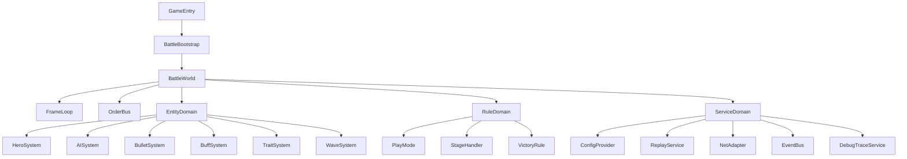

# 新战斗框架核心边界与模块映射

## 目标

这份文档用于指导在新的 `Unity + HybridCLR` 项目中重建一套更清晰、可维护、可扩展的战斗框架。

目标不是把旧项目战斗代码整包复制过去，而是：

- 保留旧系统最有价值的能力：固定逻辑帧、指令驱动、回放/补帧、玩法扩展点、关卡扩展点。
- 重构旧系统中维护成本较高的部分：全局单例穿透、超大总控类、弱语义指令、业务规则散落。
- 为后续按玩法域逐步迁移旧逻辑保留落脚点。

## 旧系统中建议保留的核心思想

- 固定逻辑帧驱动：逻辑更新与渲染更新分离，战斗以稳定步长推进。
- 指令先收集、再按帧消费：输入不是直接改状态，而是变成可记录、可回放、可补帧的命令。
- 玩法与关卡规则抽象：`PlayMode + PassHandler + VictoryCondition` 这一套扩展思想值得保留。
- 角色、AI、子弹、Buff、词条分域：这些领域对象是战斗系统天然的边界。
- 手动物理推进：如果继续采用确定性更强的设计，应延续逻辑帧控制物理模拟的原则。

## 旧系统中建议重构的部分

- 不再依赖 `Global.gApp` 式全局单例穿透所有层。
- 不再让 `LDFightScene` 继续承担过多职责。
- 不再使用 `PM1/PM2/LV/SQ` 这种弱语义字段表达复杂命令。
- 不再让玩法特例直接写进实体对象。
- 不再让消息广播链路成为黑盒，必须补足调试可观测性。

## 新框架建议分层



## 建议目录结构

```text
Assets/
  Game/
    Battle/
      Runtime/
        Bootstrap/
          BattleBootstrap.cs
        Core/
          BattleWorld.cs
          BattleContext.cs
          FrameLoop.cs
          BattleTime.cs
        Commands/
          OrderBus.cs
          FrameCommandBuffer.cs
          Commands/
            MoveCommand.cs
            UseSkillCommand.cs
            SelectTraitCommand.cs
        Entities/
          Hero/
          AI/
          Bullet/
          Buff/
          Trait/
          Wave/
          Element/
        Rules/
          PlayModes/
          StageHandlers/
          VictoryRules/
        Services/
          Replay/
          Network/
          Config/
          Events/
          DebugTrace/
        Presentation/
          Camera/
          Vfx/
          Hud/
      Hotfix/
        BattleRules/
        Traits/
        Buffs/
        PlayModes/
```

## 分层职责

### 1. Bootstrap 层

- 负责进入战斗时创建 `BattleWorld`。
- 接入场景、加载、UI、资源预热。
- 只负责“启动”和“销毁”，不承载战斗业务逻辑。

### 2. Core 层

- `BattleWorld` 是战斗运行时上下文。
- `FrameLoop` 负责固定步长推进。
- `BattleContext` 持有当前战斗依赖与状态快照。
- Core 层不直接关心具体玩法规则，只负责调度。

### 3. Commands 层

- 所有输入统一转为强类型命令。
- 命令分为“本地采集”“网络回推”“回放重放”三种来源。
- `FrameCommandBuffer` 以帧号组织命令。
- `OrderBus` 负责发送、接收、校验、补帧请求与命令分发。

### 4. Entities 层

- 承载领域对象和系统更新逻辑。
- 按域拆分：`HeroSystem`、`AISystem`、`BulletSystem`、`BuffSystem`、`TraitSystem`、`WaveSystem`。
- 实体层只保留通用行为，不直接写关卡规则或运营活动规则。

### 5. Rules 层

- `PlayMode`：玩法维度的规则。
- `StageHandler`：关卡/副本维度的规则。
- `VictoryRule`：胜负条件与结算条件。
- 规则层应是最主要的业务扩展入口。

### 6. Services 层

- `ConfigProvider`：配置读取与适配。
- `ReplayService`：回放、录制、重播。
- `NetAdapter`：网络协议与命令同步适配。
- `EventBus`：事件广播。
- `DebugTraceService`：帧号、状态切换、锁敌变化、Buff 增删、伤害链路追踪。

### 7. Presentation 层

- 承载摄像机、特效、表现层 HUD。
- 与逻辑层保持单向依赖。
- 不允许表现层直接改动逻辑状态。

## 旧系统到新系统的建议映射

| 旧系统模块 | 新系统建议模块 | 迁移建议 |
|---|---|---|
| `LDFightScene` | `BattleBootstrap + BattleWorld + FrameLoop` | 拆分生命周期、上下文、循环控制，不再保留大总管类 |
| `LDFightFrameCtrl` | `FrameLoop` | 保留帧驱动思想，但减少场景层包装 |
| `LDCtrollerOrder` | `OrderBus + FrameCommandBuffer + ReplayService` | 改成强类型命令，保留按帧消费和补帧思想 |
| `LDRoleMgr` | `HeroSystem + AISystem + EntityRegistry` | 将玩家与怪物更新职责拆开 |
| `LDMainRole` | `BattleSideContext` 或 `HeroPartyContext` | 如果需要保留“我方阵营聚合器”，应明确边界 |
| `LDHeroPlayer` | `HeroEntity + HeroStateController + WeaponFireService` | 保留英雄领域能力，但拆出发射、状态、表现逻辑 |
| `LDWaveMgr` | `WaveSystem + SpawnSystem` | 波次控制与刷怪行为拆层 |
| `LDHeroBulletEmitter` | `WeaponFireService + BulletFactory` | 发射与子弹构建职责拆分 |
| `LDCiTiaoMgr` | `TraitSystem` | 词条保留为一等公民系统 |
| `LDPassHandler` | `StageHandler` | 继续作为关卡扩展点，但约束职责 |
| `LDPlayModeBase` | `PlayMode` | 继续作为玩法扩展点 |
| `LDVictoryBase` | `VictoryRule` | 胜负判定继续独立 |

## HybridCLR 边界建议

### 放在稳定程序集的内容

- `BattleWorld`
- `FrameLoop`
- `OrderBus`
- 核心命令类型
- 基础实体结构
- 子弹基础运行时
- 基础 Buff/Trait 框架

### 放在热更层的内容

- 玩法规则
- 关卡规则
- 特殊 Buff
- 特殊词条
- 活动副本玩法
- 配置驱动的技能脚本

### 原则

- 越底层、越频繁执行、越强调稳定性的部分，越不适合频繁热更。
- 越靠近玩法规则和活动变化的部分，越适合热更。

## 新框架必须满足的非功能要求

- 能追踪每一帧的命令来源与消费结果。
- 能记录并回放关键战斗切片。
- 能独立压测 Hero、AI、Bullet、Buff、Trait 等系统耗时。
- 能在不依赖全局单例的前提下创建最小战斗闭环。
- 能让新人通过目录结构直接理解模块边界。

## 最小闭环成功标准

- 单英雄可移动、锁敌、攻击。
- 单波怪可生成、追击、受击、死亡。
- 子弹可发射、命中、结算伤害。
- `StageHandler` 可控制基本关卡流程。
- `VictoryRule` 可正确结算胜负。
- `OrderBus` 可按帧消费命令。
- 回放接口与补帧接口已预留。
